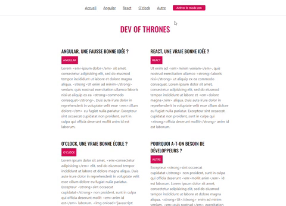

# Blog-exemple

Un exemple de blog qui a été crée à l'aide de React et Typescript

## Description

Ce projet est un exemple de blog développé en utilisant React. Il récupère les données des catégories et des articles à partir de l'API publique <https://oclock-open-apis.vercel.app/api/blog> et les affiche sur la page. Le blog comprend un en-tête avec une barre de menu pour les catégories et un bouton pour activer le mode zen, ainsi qu'un pied de page avec des informations sur le blog. Le projet utilise également des interfaces TypeScript pour garantir le typage des données.

## Technologies utilisées

React, Axios, TypeScript, SASS.

## Fonctionnalités

- Affichage des catégories et des articles à partir de l'API publique.
- Possibilité d'activer le mode zen pour une expérience utilisateur plus agréable.
- Utilisation d'interfaces TypeScript pour garantir le typage des données.
- Design responsive et moderne avec SASS.

## Demonstration

